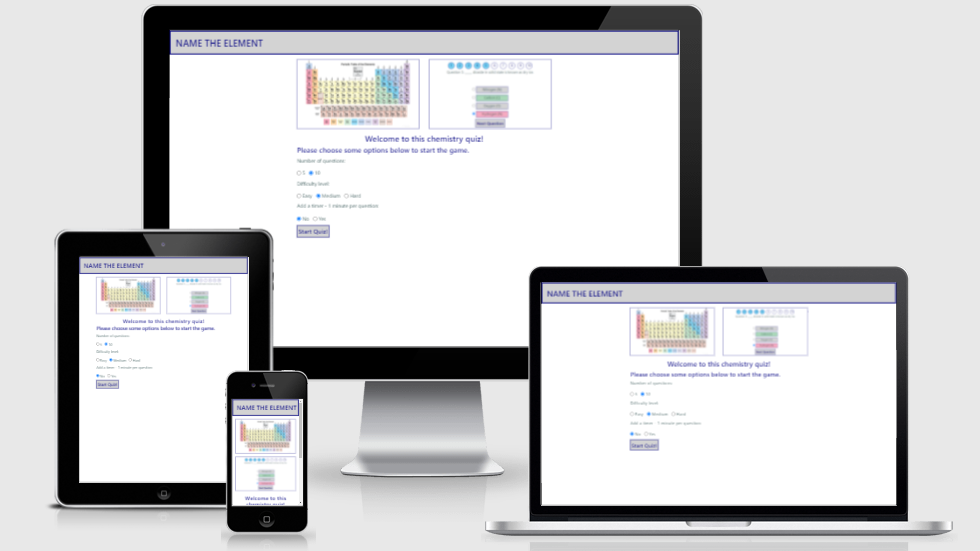
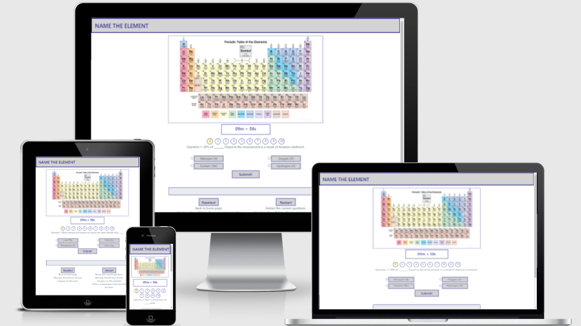

# Name the Element

[Link to live project.](https://mayasharma2110.github.io/Name-the-element/)

This is a website for a chemistry quiz.  

It is aimed for those who are interested in improving their current chemistry knowledge or learning some more interesting facts. 

Mockups:

## Table of Contents

* [UX](#ux)
  * [User Stories](#user-stories)
    * [First Time Visitor Goals](#first-time-visitor-goals)
    * [Returning Visitor Goals](#returning-visitor-goals)
    * [Frequent User Goals](#frequent-user-goals)
  * [Strategy](#strategy)
    * [Business Goals](#business-goals)
    * [User Goals](#user-goals)
  * [Scope](#scope)
  * [Structure](#structure)
   * [Wireframes Home](#wireframes-home)
   * [Wireframes Quiz](#wireframes-quiz)
   * [Wireframes Comments](#wireframes-comments)
  * [Skeleton](#skeleton)
    * [Colours](#colours)
    * [Imagery](#imagery)
  * [Surface](#surface)
* [Features](#features)
    * [Existing Features](#existing-features)
    * [Features Left to Implement](#features-left-to-inplement)
* [Technologies Used](#technologies-used)
* [Testing](#testing)
  * [Local Storage](#correct-answer)
  * [Randomize Array](#randomize-array)
  * [Current Question Bar](#current-question-bar)
  * [Incorrect Answer](#incorrect-answer)
  * [Correct Answer](#correct-answer)
  * [Label Colours](#label-colours)
  * [Progress Bar](#progress-bar)
  * [Timer](#timer)
  * [Timer Reset](#timer-reset)
  * [Game Complete](#game-complete)
  * [Online Validation](#online-validation)
  * [Lighthouse Validation](#lighthouse-validation) 
  * [User Stories from the UX Section](#user-stories-from-the-ux-section)
* [Deployment](#deployment)
  * [Creation](#creation)
  * [GitHub Pages](#github-pages)
  * [Local Clone](#local-clone)
  * [Forking](#forking)
* [Credits](#credits)
  * [Code](#code)
  * [Content](#content)
  * [Media](#media)
  * [Acknowledgments](#acknowledgments)

## UX

### User Stories

#### First Time Visitor Goals

* As a first time user, I want the instructions to be clear for the quiz.

* As a first time user, I want to see an example question of the quiz before I start the game.

* As a first time user, I want to be provided with clear feedback of how I am progressing during the quiz and also at the end.

* As a first time user, I want to have fun playing the game and learn new facts.

* As a first time user, I want to be able to from a range of difficulty levels depending on my knowledge of chemistry.

* As a first time user, I want to be able to start the current quiz questions again.

* As a first time user, I want to be able to go back to the home page and re-select the number of questions and/or 
the difficulty level.

#### Returning Visitor Goals

* As a returning user, I want the to achieve many of the same goals as a first time visitor.

* As a returning user, I want to be able to select the number of questions the quiz will give me.

* As a returning user, I want to be able to choose another difficulty level depending on my knowledge level of chemistry and 
how well I did on the quiz on my first attempt.

#### Frequent User Goals

* As a frequent user, I want to add a timer to the quiz to challenge myself further.

* As a frequent user I want the to achieve many of the same goals as a first time visitor and a returning visitor.

### Strategy

#### Business goals

* Are the same as the user goals for this project, to enjoy playing the game and learn new facts!

#### User Goals

* To improve their chemistry knowledge.

* To learn new facts about chemistry.

* To enjoy playing the game while learning at the same time.

### Scope

Key features to be included based on user stories are:

* Responsive website on mobile, tablet and laptop size devices.

* The home page will show an image example of a question and the multiple choice options for the user to choose from.

* The home page will contain radio buttons for the user to select how many question they want their quiz to contain, 
the difficulty level of the quiz they want and if they want it to be a timed quiz or not.

* The home page will contain a start button for the user to start the quiz using the options they selected above.

* The quiz page will clearly display what question the user is on, how many they have answered and how many are left to complete.

* The quiz page will display clear feedback to the user after each question.

* The quiz page will display a users score/progress in terms of a progress bar 
with different colours to represent correct/incorrect answers.

* The quiz page will also have a buttons for the user to progress to the next question, 
restart the current quiz questions again or to the home page and reselect the options for their quiz.

* At the end of the quiz the user will be presented with how many questions they answered, the number of questions correct and incorrect (with percentages).

* At the end of the quiz the user will be presented with a play again button to take the user to the home page.

### Structure

All pages of the website will have a consistent navigation bar.

The website will use bootstrap grids to make the layout responsive to different devices and screen sizes.

The home page will contain an image example of a question and the multiple choice options for the user to choose from. 
Below this there will be options for the user to select about the type of quiz they want to play. 
At the bottom there will be a start quiz button.

The quiz page will contain a bar showing the question the user is currently on, how many have been completed and how many are left to complete.
Below this will be the question along with 4 multiple choice options, and below a submit button. 
Below the submit button is where user feedback will be displayed if they answered correctly or not. 
Once the user has clicked submit this button will disappear and there will be a next question button in it's place.
Below any feedback will be the progress bar showing the percentage of correct and incorrect answers.
Finally at the bottom there will be 2 buttons to allow the user to reselect their quiz options (go to the home page) or
to start the current quiz questions again.

At the end of the quiz the site will show how many questions the user answered, the number correct and incorrect (with percentages). 
At this point the site will show the play again button to take the user to the home page, where they can reselect choices and play another quiz.

If the user decides to have a timed quiz the timer will be shown above the progress bar.

### Skeleton

I used Balsamiq to make the wireframes for this project. The website was designed to have 2 pages - Home and Quiz.
The wireframes were created for all pages for phone, tablet and desktop devices.

#### Wireframes Home

Mobile

  

Tablet

Desktop

  

#### Wireframes Quiz

Mobile

  

Tablet

 

Desktop

 

#### Wireframes Comments

Please note there are a few changes to the final site since the wireframes were made:

  * The quiz page contains the image of the periodic table of elements from the home page, this gives users a reference when answering the questions.
  * On a phone the restart button is below the reselct button due to limited space.
  * On the quiz page the location of the timer was not included, in the final site this was located above the progress bar.

### Surface

#### Colours
I used the image of the periodic table of elements to get the colours used in this site. 
I used a muted green (#aad9b8), yellow (#fcf9bf) and red (#f7aac0) from this image using the toggle color picker 
within chrome developer tools. 
For the navbar and headings text I picked navy and other text uses darkslategrey.

#### Imagery
I picked a image of the periodic table of elements as credited in the credits - media
section of this readme. The site mentioned has many images available but 
I picked this as it is colourful, it is also has muted colours which makes this 
a website that a user of any age would like to use. 

## Features

### Existing Features

* Responsive on mobile, tablet and laptop size devices.

* The home page shows an image of the periodic table of elements and also an image example of a question and the multiple choice options for the user to choose from.
This makes the purpose of the site clear to the user and lets them know what to expect.

* On the home page the user can pick number of questions and difficulty level.
The user can pick if there is a timer on the quiz or not. After selecting options the user can start the quiz.

* The quiz page has multiple features:
  * Contains the image of the periodic table of elements from the home page, this gives users a reference when answering the questions.
  * Shows the countdown for timed quizzes.
  * Shows the user what question they are on, how many they have completed and how many are left.
  * Shows the current question and its options, the order of questions is randomized.
  * Contains submit and next question buttons allowing the user to progress through the quiz questions (only one button is shown at a time).
  * After submitting an answer for each question the user is provided with feedback in text form.
  * After submitting an answer if correct the selected/correct option is highlighted in green and if incorrect the selected option is highlighted in pink and the correct answer is highlighted in green.
  * After submitting an answer for each question the progress bar is updated showing the percentage of correct/incorrect answers so far.
  * Contains buttons allowing the user to restart the current quiz questions again or to the home page and reselect the options for their quiz.

* At the end of the quiz:
  * Overall feedback is displayed showing how many questions the user answered, the number correct and incorrect (with percentages).
  * Play again button which will take the user to the home page.

### Features Left to Implement

* It would be nice to have a larger number of question options for the quiz. 

* This concept could also be expanded to include quizzes for other subjects of interest such as biology and physics.

* If the site had a user sign in capabilities and stored data on users of the quiz 
this could allow the user to track their progress and also compare to others.

## Technologies Used

* HTML - used to create the main content for the website.

* CSS - used to add style and colour to the content.

* Javascript - used to make responsive to the user's input.

* [Bootstrap Version 4.1.3](https://getbootstrap.com/docs/4.1/getting-started/download/)
  * Used grid layout to ensure the content was responsive to different device sizes (mobile, tablet and laptop).

* [Gitpod](https://www.gitpod.io/) - used to write the code for the website.

* [GitHub](https://github.com/) - used to store the current and previous versions of the code. It was also used to host the live website through GitHub Pages. 

* [Balsamiq Wireframes](https://balsamiq.com/wireframes/) - used to create the wireframes for the website.

* [Tinypng](https://tinypng.com/) - used to compress the images so they loaded quicker on the website.

* [Am I Responsive](http://ami.responsivedesign.is/#) - used for the mockups of the website on different devices.

## Testing

### Local Storage

Expected - I expected the variables I saved (taken from user input on home page), to be available to use in the quiz.

Testing - I tested this by logging the varaible values to the console and commenting out the below code 
which worked, however when the user was directed to the quiz page (below code was not commented out) these variables were lost.

> document.getElementById("user-options").submit();

Fix - For this reason I stored the 3 variables (number, difficulty and timer) in local storage so they could be accessed when on the quiz page.
Detailed information on how local storage works is at the sites [w3schools](https://www.w3schools.com/html/html5_webstorage.asp) and [MDN Web Docs](https://developer.mozilla.org/en-US/docs/Web/API/Web_Storage_API).

I used code as given below:

> localStorage.setItem("number", number);

> let number = localStorage.getItem("number");

### Random Array

I wanted the order of questions to be randomized and not in the same order each time, 
I used the below code which I found on [stackoverflow](https://stackoverflow.com/questions/2450954/how-to-randomize-shuffle-a-javascript-array) to randomize the array of questions.

> let randomizedarray = array.sort(() => Math.random() - 0.5);

### Current Question Bar

For the current question bar I wanted the background colours for the numbers to be responsive to what question the user was on and what questions they had completed.
To do this I needed to target an element based on an index in jQuery.
The offical [jQuery](https://api.jquery.com/eq/) documentation helped me do this.

> $("#current_question").children().eq(currentQuestionNumberIndex).addClass("current_question_color");

> $("#current_question").children().eq(currentQuestionNumberIndex).removeClass("current_question_color").addClass("completed_question_color");

Expected - Show the question the user is on in yellow background and the questions completed with a green background. When the user clicks submit the current question turns from yellow to green.
When the user clicks next question the next question turns yellow.

Testing - Tested the feature by going through a quiz and checking the current question bar.

Result - The feature acted as normally and the background colours responded to the submit and next question buttons.

### Incorrect Answer

Expected - When the user clicks on an incorrect answer I wanted the user to be told they were wrong and given the correct answer in text format.

Testing - Tested the feature by selecting a wrong answer and submit.

Result - The feature acted as normally and it displayed text saying the user was wrong along with the correct answer.

### Correct Answer

Expected - When the user clicks on the correct answer I wanted the user to be told they were correct in text format.

Testing - Tested the feature by selecting the correct answer and submit.

Result - The feature did not respond and showed the user was wrong.

Fix - The inputs did not have the correct value to allow it to validate the correct answer.
I updated the below code to from

> input id="option1" type="radio" name="option" value="option1" required

to 

> input id="option1" type="radio" name="option" value="${quizQuestions[currentQuestionNumberIndex].option1}" required

### Label Colours 

Expected - When the user clicks to submit an answer the background colour of the selected label turns green or pink depending if the user is correct or not.
If the user is incorrect the right answer is shown in green.

Testing - Tested the feature by selecting a correct/incorrect answer on the quiz.

Result - The feature acted as normally and it did update the background colour of the selected label, and of the right answer if the user was incorrect.

### Progress Bar 

Expected - The progress bar is expected to update as the user progresses through the quiz and update based on what number/percentage of questions are correct/incorrect.

Testing - Tested the feature by going through a quiz and checking the progress bar after each question was submitted.

Result - The feature acted as normally and it did update based on what number/percentage of questions are correct/incorrect.

### Timer

Expected - Expected the timer to start at 5/10 minutes 0 seconds.

Testing - Tested the feature by loading a 5 or 10 minute quiz.

Result - The feature did not respond as expected and started at 4 minutes 58 seconds.

Fix - I did ... add some text.

### TImer Reset

Expected - Timer responds to the reset button.

Testing - Tested the feature by clicking reset several times during a timed quiz and checking the countdown restarted.

Result - The feature acted as normally and it did reset the countdown.

### Game Complete

For untimed quizzes:

Expected - When the user completes all questions the submit button, reselect and restart buttons are not displayed and the play again button is shown. 
Additionally there is text below the progress bar to show how many questions the user answered, and what number/percentage were correct and incorrect.

Testing - Tested the feature by going through a quiz and checking the text below the progress bar was appropriate and the correct buttons were displayed.

Result - The feature acted as normally and it shows the right text and buttons.

For timed quizzes: 

Expected - In addition to the above for timed quizzes if the user finishes before the timer runs out the countdown stops and instead of the time "GAME COMPLETE!" is shown.
If the user does not finish in time the text "TIME'S UP!" will show in place of the countdown.

Testing - Tested the feature by going through a timed quiz and checking the countdown ended and the page shows the correct text in place.

Result - The feature acted as normally and it shows the right text instead of the countdown.

### Online Validation

* I checked the website loads and responds as expected on Google Chrome, and Microsoft Edge browsers. 
I tested on Internet Explorer but the quiz did not work possibly due to the the version of Internet Explorer on my laptop being old.

* Used chrome developer tools and [responsinator](https://www.responsinator.com/) to check responsiveness on mobile, tablet and laptop devices.  
I also checked the website on my HP 15 inch laptop, Philips 20 inch monitor and Sony smartphone.

* Used the [w3c validator](https://validator.w3.org/) to validate my html (for both pages of the website) to check for no errors or warnings. 
* Used the [jigsaw validator](https://jigsaw.w3.org/css-validator/#validate_by_input) to validate my style.css file to check for no errors or warnings. 
I did not validate css of the whole website as this included the imported bootstrap files.

* Used [Jshint](https://jshint.com/) to validate my js files and ensure no warnings or errors.

### Lighthouse Validation

I used [lighthouse](https://developers.google.com/web/tools/lighthouse) in chrome developer tools to check the websites performance in terms of 
performance, accessibility, best practises and SEO.
This was done for both pages of the website and for both mobile and desktop devices.
The summary table below shows these metrics.

| Device | Page |  Performance | Accessibility  | Best Practises  | SEO |
|---|---|---|---|---|---|
| Mobile  |  Home | 84% | 100% | 100% | 100% |
| Mobile  |  Quiz | 87% | 98% | 100% | 100% |
| Desktop  | Home | 100% | 100% | 100% | 100% |
| Desktop  | Quiz | 98% | 98% | 100% | 100% |

Full reports can be found below:
* [Mobile Home](assets/lighthouse/lighthouse-mobile-home.pdf)
* [Mobile Quiz](assets/lighthouse/lighthouse-mobile-quiz.pdf)
* [Desktop Home](assets/lighthouse/lighthouse-desktop-home.pdf)
* [Desktop Quiz](assets/lighthouse/lighthouse-desktop-quiz.pdf)

### User Stories from the UX Section

* First Time Visitor Goals  

  * As a first time user, I want the instructions to be clear for the quiz.
    * On the home page of the site the quiz has some introduction text to tell the user what to expect and do.

  * As a first time user, I want to see an example question of the quiz before I start the game.
    * There is an example of a quiz question on the home page of the site showing a question and the response when the user is wrong.

  * As a first time user, I want to be provided with clear feedback of how I am progressing during the quiz and also at the end.
    * The site provides textual feedback, in addition to highlighting of the labels to show the user if they were correct or not.
    The site also provides a progress bar so the user knows how they are doing in general.

  * As a first time user, I want to have fun playing the game and learn new facts.
    * The site has a variety of difficulty levels for the user to select depending on their knowledge, this means a user of any ability can enjoy playing the quiz.

  * As a first time user, I want to be able to from a range of difficulty levels depending on my knowledge of chemistry.
    * There are 3 options for difficulty level on the home page of the site which the user can select from.

  * As a first time user, I want to be able to start the current quiz questions again.
    * The quiz has a reset button and will take the user back to the first question and reset the scores and progress bar. The timer will also restart if it is a timed quiz. There is also a warning below the button.
  * As a first time user, I want to be able to go back to the home page and re-select the number of questions and/or the difficulty level.
    * The site has a reselect button which takes the user back to the home page of the site, there is a warning below the button.

* Returning Visitor Goals

  * As a returning user, I want the to achieve many of the same goals as a first time visitor.
    * As above.

  * As a returning user, I want to be able to select the number of questions the quiz will give me.
    * The site has 2 options for 5 or 10 questions in the quiz for the user to select.

  * As a returning user, I want to be able to choose another difficulty level depending on my knowledge level of chemistry and how well I did on the quiz on my first attempt.
    * There are 3 options for difficulty level on the home page of the site which the user can select from.

* Frequent User Goals
    
  * As a frequent user, I want to add a timer to the quiz to challenge myself further.
    * The site has an option to add a timer to the quiz of 1 minute per question to challenge users that want extra difficulty.

  * As a frequent user I want the to achieve many of the same goals as a first time visitor and a returning visitor.
    * As above.

* Business Goals

  * Are the same as the user goals for this project, to enjoy playing the game and learn new facts!
    * As above.

## Deployment

### Creation

* All code was written in Gitpod and used [this template](https://github.com/Code-Institute-Org/gitpod-full-template) from Code Institute.
* Files were added to the staging area using "git add ."
* Files were committed to the local repository using "git commit -m 'commit message here'".
* Committed changes were pushed to the GitHub repository.

### GitHub Pages

To deploy the project to a live website the below steps were followed:

* Navigate to the GitHub repository you wish to deploy.
* Click on Settings and scroll to the "GitHub Pages" section.
* Choose "master branch" as the source and click save.
* Scroll back down to the "GitHub Pages" section and the deployed website link will be given.
* Note: It can take a few moments for the website to be deployed, so the link may not work immediately 
after you deploy using GitHub Pages.

### Local Clone
To make a local copy of a repository on your own GitHub account you can clone it.
This allows others to view the original code and/or make changes to it (on their own local copy).
Changing the code on your local repository will not affect the original code or deployed website.

To clone a repository in GitHub you can follow the steps below:
* Log into GitHub and locate the repository you wish to clone.
* Click on the code button (to the left of the green Gitpod button) and copy the https URL given.
* Open Gitpod (or another editor if you prefer).
* Use the "git clone 'insert copied URL here'" command.
* A clone of the original repository will now be available for you locally 
on your own repository to view/edit as you wish.

### Forking

Forking is another way to  make a local copy of a repository on your own GitHub account to do this follow the below steps:

* Log into GitHub and locate the repository you wish to fork.
* At the top-right of the repository (and top-right of the green Gitpod button), locate the fork button.
* A copy of the original repository will now be available for you locally 
on your own repository to view/edit as you wish.

## Credits

### Code

* The bootstrap library was used to help make this website responsive for different devices. 

* The bootstrap library was also used to help make the progress bar in the quiz.   

* The code to store and retreive variables from local storage is given and explained in the sites 
[w3schools](https://www.w3schools.com/html/html5_webstorage.asp) and [MDN Web Docs](https://developer.mozilla.org/en-US/docs/Web/API/Web_Storage_API).

* The code to randomize an array was taken from this [stackoverflow post](https://stackoverflow.com/questions/2450954/how-to-randomize-shuffle-a-javascript-array).

* The code on how to select an index from an array in jQuery is given in the [jquery documentation](https://api.jquery.com/eq/).

* The [w3schools site](https://www.w3schools.com/howto/howto_js_countdown.asp) helped me to create the timer for my quiz.

### Content

* I used images from online, information below in the media section.

* For the questions in the quiz, I took chemistry facts from the sites [thoughtco](https://www.thoughtco.com), 
[tutor-pace](https://tutor-pace.typepad.com/onlinetutoring/2015/09/25-basic-and-most-interesting-chemistry-facts.html) 
and [zmescience](https://www.zmescience.com/science/chemistry/amazing-chemistry-facts/). 
These provided the question text and correct answer, 
for the incorrect options I chose these myself.

* I had a look at [Lovatts puzzles](https://lovattspuzzles.com/online-puzzles-competitions/ultimate-online-trivia-quiz/) 
to gain information on what features to include for my own quiz game.

### Media

* I found the following image online from [Science Notes](https://sciencenotes.org/): 
  * periodic-table-of-elements - owner Science Notes [image link here](https://sciencenotes.org/printable-periodic-table/)
 
* The image quiz-example is a screenshot of one of the quiz questions.
 
### Acknowledgments

* Code Institute for teaching me the basics of HTML, CSS, Bootstrap, JavaScript and jQuery to allow me to create this website.

* My mentor Antonio Rodriguez who helped provide feedback on this website and improvements that could be made.

* The Slack community for providing support throughout the course so far.  

* Thanks to the fellow students on Slack and my friends who viewed the website and gave feedback on any improvements/changes that could be made. 

* The website that I used to gain inspiration for creating my own quiz: [Lovatts puzzles](https://lovattspuzzles.com/online-puzzles-competitions/ultimate-online-trivia-quiz/).