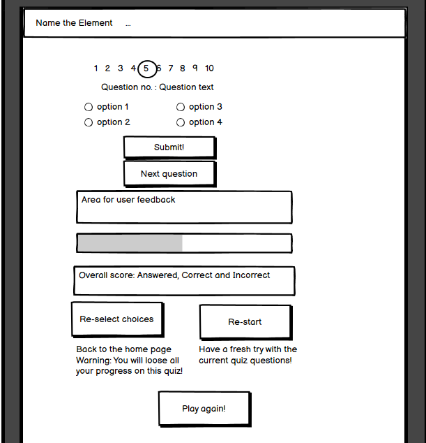

# Name the Element

[Link to live project.](https://mayasharma2110.github.io/Name-the-element/)

This is a website for a chemistry quiz.  

It is aimed for those who are interested in improving their current chemistry knowledge or learning some more interesting facts. 

Mockups:

#

#

#

## Table of Contents

* [UX](#ux)
  * [User Stories](#user-stories)
    * [First Time Visitor Goals](#first-time-visitor-goals)
    * [Returning Visitor Goals](#returning-visitor-goals)
    * [Frequent User Goals](#frequent-user-goals)
  * [Strategy](#strategy)
    * [Business Goals](#business-goals)
    * [User Goals](#user-goals)
  * [Scope](#scope)
  * [Structure](#structure)
   * [Wireframes Home](#wireframes-home)
   * [Wireframes Quiz](#wireframes-quiz)
* [Wireframes Feedback](#wireframes-feedback)
   * [Wireframes Comments](#wireframes-comments)
  * [Skeleton](#skeleton)
    * [Colours](#colours)
    * [Typography](#typography)
    * [Imagery](#imagery)
  * [Surface](#surface)
* [Features](#features)
    * [Existing Features](#existing-features)
    * [Features Left to Implement](#features-left-to-inplement)
* [Technologies Used](#technologies-used)
* [Testing](#testing)
  * [Manual Testing](#manual-testing)
  * [Online Validation](#online-validation)
  * [Lighthouse Validation](#lighthouse-validation) 
  * [User Stories from the UX Section](#user-stories-from-the-ux-section)
  * [Fixed Bugs](#fixed-bugs)
  * [Fixed Bugs](#fixed-bugs)
* [Deployment](#deployment)
  * [Creation](#creation)
  * [GitHub Pages](#github-pages)
  * [Local Clone](#local-clone)
  * [Forking](#forking)
* [Credits](#credits)
  * [Code](#code)
  * [Content](#content)
  * [Media](#media)
  * [Acknowledgments](#acknowledgments)

## UX

### User Stories

#### First Time Visitor Goals

* As a first time user, I want the instructions to be clear for the quiz.

* As a first time user, I want to see an example question of the quiz before I start the game.

* As a first time user, I want to be provided with clear feedback of how I am progressing during the quiz and also at the end.

* As a first time user, I want to have fun playing the game and learn new facts.

* As a first time user, I want to be able to from a range of difficulty levels depending on my knowledge of chemistry.

* As a first time user, I want to be able to start the current quiz questions again.

* As a first time user, I want to be able to go back to the home page and re-select the number of questions and/or 
the difficulty level.

#### Returning Visitor Goals

* As a returning user, I want the to achieve many of the same goals as a first time visitor.

* As a returning user, I want to be able to select the number of questions the quiz will give me.

* As a returning user, I want to be able to choose another difficulty level depending on my knowledge level of chemistry and 
how well I did on the quiz on my first attempt.

#### Frequent User Goals

* As a frequent user, I want to add a timer to the quiz to challenge myself further.

* As a frequent user I want the to achieve many of the same goals as a first time visitor and a returning visitor.

### Strategy

#### Business goals

* Are the same as the user goals for this project, to enjoy playing the game and learn new facts!

#### User Goals

* To improve their chemistry knowledge.

* To learn new facts about chemistry.

* To enjoy playing the game while learning at the same time.

### Scope

Key features to be included based on user stories are:

* Responsive website on mobile, tablet and laptop size devices.

* The home page will show an image example of a question and the multiple choice options for the user to choose from.

* The home page will contain radio buttons for the user to select how many question they want their quiz to contain, 
the difficulty level of the quiz they want and if they want it to be a timed quiz or not.

* The home page will contain a start button for the user to start the quiz using the options they selected above.

* The quiz page will display clear feedback to the user after each question in terms of text and colour.

* The quiz page will display a users score/progress in terms of a progress bar 
with diffierent colours to represent correct/incorrect answers.

* The quiz page will clearly display what question the user is on, how many they have answered and how many are left to complete.

* The quiz page will also have a buttons for the user to progress to the next question, 
restart the current quiz questions again or to the home page and reselect the options for their quiz.

* The feedback page will show all the questions in the quiz, along with if the user got this correct or not.
If correct it will display the correct answer and if wrong it will display the users answer and the correct one.

* The feedback page will have a play again button to take the user to the home page.

### Structure

All pages of the website will have a consistent navigation bar.

The website will use bootstrap grids to make the layout responsive to different devices and screen sizes.

The home page will contain an image example of a question and the multiple choice options for the user to choose from. 
Below this there will be options for the user to select about the type of quiz they want to play. 
At the bottom there will be a start quiz button.

The quiz page will contain a bar showing the question the user is currently on, how many have been completed and how many are left to complete.
Below this will be the question along with 4 multiple choice options, and below a submit button. 
Below the submit button is where user feedback will be displayed if they answered correctly or not. 
Once the user has clicked submit this button will disappear and there will be a next question button in it's place.
Below any feedback will be the progress bar showing the number of correct and incorrect answers.
Finally at the bottom there will be 2 buttons to allow the user to reselect their quiz options (go to the home page) or
to start the current quiz questions again.

The feedback page will contain all the questions in the quiz, along with if the user got this correct or not.
If correct it will display the correct answer and if wrong it will display the users answer and the correct one.
At the bottom the feedback page will have a play again button to take the user to the home page.

### Skeleton

I used Balsamiq to make the wireframes for this project. The website was designed to have 3 pages - Home, Quiz and Feedback.
The wireframes were created for all pages for phone, tablet and desktop devices.

#### Wireframes Home

Mobile

  

Tablet

Desktop

  

#### Wireframes Quiz

Mobile

  

Tablet

 

Desktop

 

#### Wireframes Feedback

Mobile

  

Tablet

Desktop

  

#### Wireframes Comments

Please not there are a few changes to the final site since the wireframes were made:

### Surface

#### Colours

#### Typography

#### Imagery

## Features

### Existing Features

* Responsive on mobile, tablet and laptop size devices.

* Add to here when complete.

### Features Left to Implement

* It would be nice to have a larger number of question options for the quiz. 

* This concept could also be expanded to include quizzes for other subjects of interest such as biology and physics.

* If the site had a user sign in capabilities and stored data on users of the quiz 
this could allow the user to track their progress and also compare to others.

## Technologies Used

* HTML - used to create the main content for the website.

* CSS - used to add style and colour to the content.

* Javascript - used to make responsive to the user's input.

* [Bootstrap Version 4.1.3](https://getbootstrap.com/docs/4.1/getting-started/download/)
  * Used grid layout to ensure the content was responsive to different device sizes (mobile, tablet and laptop).

* [Gitpod](https://www.gitpod.io/) - used to write the code for the website.

* [GitHub](https://github.com/) - used to store the current and previous versions of the code. It was also used to host the live website through GitHub Pages. 

* [Google Fonts](https://fonts.google.com/) - used to import the Roboto Slab and Montserrat font families that 
are used throughout the website.

* [Font Awesome](https://fontawesome.com/) - used to display the social media icons in the footer of each page.

* [Balsamiq Wireframes](https://balsamiq.com/wireframes/) - used to create the wireframes for the website.

* [Tinypng](https://tinypng.com/) - used to compress the images so they loaded quicker on the website.

* [Am I Responsive](http://ami.responsivedesign.is/#) - used for the mockups of the website on different devices.

## Testing

structure:

Expected -Feature is expected to do X why the user does Y

Testing - Tested the feature by doing Y

Result - The feature did not respond due to A,B,C

or

Result - The feature acted as normally and it did Y

Fix - I did Z to the code because something was missing

### Manual Testing

### Online Validation

* I checked the website loads and responds as expected on Google Chrome, Microsoft Edge and Internet Explorer browsers.  

* Used chrome developer tools and [responsinator](https://www.responsinator.com/) to check responsiveness on mobile, tablet and laptop devices.  
I also checked the website on my HP 15 inch laptop, Philips 20 inch monitor and Sony smartphone.

* Used the [w3c validator](https://validator.w3.org/) to validate my html (for all 3 pages of the website) to check for no errors or warnings. 
* Used the [jigsaw validator](https://jigsaw.w3.org/css-validator/#validate_by_input) to validate my style.css file to check for no errors or warnings. 
I did not validate css of the whole website as this included the imported bootstrap files.

### Lighthouse Validation

I used [lighthouse](https://developers.google.com/web/tools/lighthouse) in chrome developer tools to check the websites performance in terms of 
performance, accessibility, best practises and SEO.

Full reports can be found below:
* [Mobile Page1](assets/lighthouse/lighthouse-mobile-page1.pdf)
* [Mobile Page2](assets/lighthouse/lighthouse-mobile-page2.pdf)
* [Desktop Page1](assets/lighthouse/lighthouse-desktop-page1.pdf)
* [Desktop Page2](assets/lighthouse/lighthouse-desktop-page2.pdf)

### User Stories from the UX Section

* First Time Visitor Goals  

  * As a first time user...
    * How the site acomplishes this.

  * As a first time user...
    * How the site acomplishes this.

  * As a first time user...
    * How the site acomplishes this.
  
  * As a first time user...
    * How the site acomplishes this.

* Returning Visitor Goals

  * As a returning user...
    * How the site acomplishes this.

  * As a returning user...
    * How the site acomplishes this.

  * As a returning user...
    * How the site acomplishes this.

  * As a returning user...
    * How the site acomplishes this.

* Frequent User Goals

  * As a frequent user...
    * How the site acomplishes this.
    
  * As a frequent user...
    * How the site acomplishes this.

* Business Goals

  * Are the same as the user goals for this project, to enjoy playing the game and learn new facts!
    * How the site acomplishes this.

### Fixed Bugs

#### Minor Fixes

## Deployment

### Creation

* All code was written in Gitpod and used [this template](https://github.com/Code-Institute-Org/gitpod-full-template) from Code Institute.
* Files were added to the staging area using "git add ."
* Files were committed to the local repository using "git commit -m 'commit message here'".
* Committed changes were pushed to the GitHub repository.

### GitHub Pages

To deploy the project to a live website the below steps were followed:

* Navigate to the GitHub repository you wish to deploy.
* Click on Settings and scroll to the "GitHub Pages" section.
* Choose "master branch" as the source and click save.
* Scroll back down to the "GitHub Pages" section and the deployed website link will be given.
* Note: It can take a few moments for the website to be deployed, so the link may not work immediately 
after you deploy using GitHub Pages.

### Local Clone
To make a local copy of a repository on your own GitHub account you can clone it.
This allows others to view the original code and/or make changes to it (on their own local copy).
Changing the code on your local repository will not affect the original code or deployed website.

To clone a repository in GitHub you can follow the steps below:
* Log into GitHub and locate the repository you wish to clone.
* Click on the code button (to the left of the green Gitpod button) and copy the https URL given.
* Open Gitpod (or another editor if you prefer).
* Use the "git clone 'insert copied URL here'" command.
* A clone of the original repository will now be available for you locally 
on your own repository to view/edit as you wish.

### Forking

Forking is another way to  make a local copy of a repository on your own GitHub account to do this follow the below steps:

* Log into GitHub and locate the repository you wish to fork.
* At the top-right of the repository (and top-right of the green Gitpod button), locate the fork button.
* A copy of the original repository will now be available for you locally 
on your own repository to view/edit as you wish.

## Credits

### Code

* The bootstrap library was used to help make this website responsive for different devices. 

* Bootstrap also allowed me to create a dropdown navigation bar for smaller devices.  

### Content

* I used images from online, information below in the media section.

* Questions for the quiz from sites: xxxxxxx.

* I had a look at exisiting quizzes on sites to gain information on what features to include for my own quiz game: xxxxx.

### Media

* I found the following images online from [website link](https://www.pexels.com/): 
  * img1 - owner xxxx xxxx [image link here](https://www.pexels.com/photo/white-horse-running-on-green-field-1996337/)
 
* Please note I did minor editing (cropping only) to some of these photos.
 
### Acknowledgments

* Code Institute for teaching me the basics of HTML, CSS, bootstrap, JavaScript and jQuery to allow me to create this website.

* My mentor Antonio Rodriguez who helped provide feedback on this website and improvements that could be made.

* The Slack community for providing support throughout the course so far.  

* Thanks to the fellow students on Slack and my friends who viewed the website and gave feedback on any improvements/changes that could be made. 

* The websites that I used to gain inspiration for creating my own quiz 
([website1](https://hall-place.com/) and [website2](http://palmers-stables.com/)).